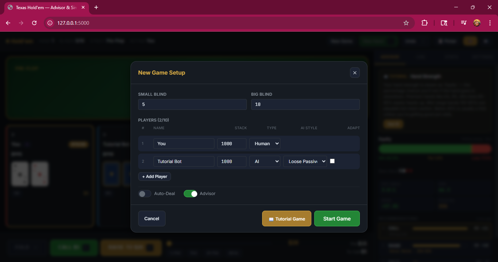
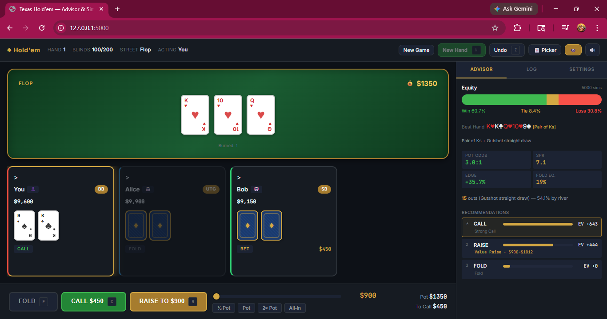

# Texas Hold'em Poker Advisor & Simulator

## Screenshots




## Description

A local web-based Texas Hold'em game with AI opponents and a real-time strategy advisor. Play practice games against configurable AI, or use Card Picker mode as a cheat sheet during live games — enter the cards being dealt in real life and get instant equity, outs, pot odds, and action recommendations.

Built with Python/Flask backend and vanilla JS frontend. No databases, no accounts, no external dependencies beyond Flask. Runs entirely on your machine.

  

## Quick Start

```bash
pip install -r requirements.txt
python app.py
```

Open **http://localhost:5000** in your browser.

## Features

### Game Engine
- Complete Texas Hold'em rules: preflop through river with full showdown
- Correct betting: min-raise enforcement, all-in handling, side pot calculation
- Burn cards, dealer rotation, blind posting (short stacks go all-in for partial blinds)
- Busted players auto-eliminated between hands
- Full undo stack — undo individual actions or rewind an entire hand
- Game-over detection with winner announcement

### AI Opponents (2–10 players)
- **Loose-Passive**: Calls wide, rarely raises, low bluff frequency
- **Tight-Aggressive**: Folds weak hands, 3-bets strong, pressures opponents
- **GTO**: Balanced ranges, mixed strategies, positional awareness
- **Random** (default): Picks a different base style each decision — unpredictable
- **Difficulty Presets**: Easy / Medium / Hard / Expert — bundles AI style, timing, variance, and equity simulations
- Configurable think time and variance (0% robotic → 100% erratic)
- Speed presets: Fast/Practice, Realistic, Tournament
- Tracks opponent VPIP and aggression factor over time

### Strategy Advisor
Real-time recommendations for human players based on standard poker math:

- **Equity**: Monte Carlo simulation (1000 iterations post-flop) + instant preflop lookup table (169 canonical hands)
- **Best Hand**: Shows your current best 5-card hand with colored mini-card display
- **Outs**: Count with draw identification (flush draw, open-ended straight, gutshot, overcards)
- **Pot Odds**: Required equity to call, displayed as ratio
- **Stack-to-Pot Ratio (SPR)**: Color-coded depth indicator
- **Equity Edge**: Your equity minus pot odds — positive means profitable
- **Fold Equity**: Estimated probability opponents fold to your bet
- **Action Rankings**: All viable actions sorted by Expected Value with labeled bars
- **Bet Sizing**: Recommended range with green indicator on the bet slider, labeled as Value / Semi-Bluff / Bluff
- **All-In Detection**: Recommends all-in when pot-committed (low SPR) or holding premium equity

The advisor uses incremental EV calculation (`equity × (pot + cost) - cost`) — the standard pot-odds formula from poker theory. Bet ranges are always clamped to your actual remaining stack. Can be toggled on/off instantly without affecting AI play.

Every abbreviated stat (SPR, EV, VPIP, etc.) has a tooltip explaining the full term and what it means.

### Card Picker (Cheat Sheet Mode)
Use during live games to get advisor recommendations on real hands:

- Visual 52-card grid (4 suit columns × 13 ranks)
- Click cards to assign to any player or the community board
- Click assigned cards on the table to unassign
- Used cards grayed out to prevent duplicates
- Full advisor analysis runs on manually entered cards

### Pass & Play
For sharing one device between multiple human players:

- **Hide Hands**: Only the active player's cards are visible (on by default)
- **Countdown Overlay**: "Pass the device — 3... 2... 1..." between human turns
- **Single Human**: When you're the only human, your cards always show — no countdown needed
- **All-AI**: When no humans remain in a hand, all cards are visible
- Configurable countdown duration (1–10 seconds)
- All hands revealed at showdown regardless of settings

### Player Management
- 2–10 players per table
- Double-click any player seat between hands to edit name, type, AI style, stack, and color
- Color picker for seat customization
- Mid-game type switching (human ↔ AI) between hands

### Stats Dashboard
Per-player statistics tracked across all hands:
- **Win Rate**: Hands won / hands played
- **VPIP**: Voluntarily Put In Pot percentage (visual bar)
- **Aggression Factor**: Raise-to-call ratio
- **WTSD**: Went To Showdown percentage
- **W$SD**: Won Money at Showdown percentage
- Net P&L, biggest pot won, fold/raise counts

### Hand History
- Live action log with color-coded player names and street headers
- Full scrollable history of all previous hands with winners and amounts
- Hole cards and hand ranks preserved in history exports
- Pot size tracked after each action
- Copy to clipboard or download as `.txt` file

### Sound Effects
All synthesized via Web Audio API — no external audio files:
- Card deals, chip bets, checks, folds, street reveals
- Win fanfare (ascending triad)
- Pass-and-play countdown ticks
- On by default, toggle via toolbar or `M` key

### Animations
CSS keyframe animations for a polished feel:
- Card dealing (flip + slide), chip sliding to pot, pot win glow
- Dealer button pop, street badge entrance, fold fade-out
- AI thinking pulse, active turn glow, connection status pulse

### Mobile Responsive
- Optimized layout at 600px breakpoint for phones
- Smaller cards and seats, full-width sidebar
- Touch-friendly button targets (44px minimum)

### Settings
- **AI Difficulty**: Easy / Medium / Hard / Expert (or Custom for manual tuning)
- **Advisor Precision**: Configurable Monte Carlo simulation count (100–5000)
- AI speed preset and variance (visible in Custom mode)
- Burn cards toggle
- Card Picker mode
- Advisor on/off
- Auto-deal (configurable delay after showdown)
- Blind escalation (every N hands × multiplier)
- Pass & Play countdown duration
- Hide Hands toggle

### Keyboard Shortcuts

| Key | Action |
|-----|--------|
| `F` | Fold |
| `C` | Check / Call |
| `R` | Raise / Bet |
| `N` | New Hand |
| `Z` | Undo |
| `M` | Toggle Sound |

## Architecture

**Backend**: Python Flask + Flask-SocketIO. Game state is a Python class, serialized to JSON per request. All game logic is server-side — the frontend is a render layer.

**Frontend**: Single HTML page with Alpine.js for reactivity and Socket.IO for real-time AI action streaming. Pure CSS playing cards (no images). Dark poker theme with CSS custom properties.

**AI Actions**: Run in background threads via SocketIO, pushing state updates as each AI player acts. A game version counter prevents stale threads from interfering after New Game.

**Equity Calculator**: Preflop uses a lookup table of 169 canonical starting hands for instant results. Post-flop runs Monte Carlo simulation (1000 iterations for advisor, 500 for AI decisions) in a background thread.

**Resilience**: Socket.IO auto-reconnects with exponential backoff. State is re-synced on reconnect. AbortController cancels stale HTTP advisor fetches. Socket-pushed advisor data cancels redundant HTTP requests.

```
holdem/
├── app.py                     # Flask + SocketIO entry point, REST API
├── requirements.txt           # flask, flask-socketio
├── engine/
│   ├── __init__.py            # Package exports
│   ├── deck.py                # Card (immutable), Deck (shuffle/draw/burn)
│   ├── hand_eval.py           # Exhaustive 7-choose-5 evaluator, all 10 hand ranks
│   ├── player.py              # Player model, AI styles, stats tracking
│   ├── betting.py             # Betting round validation, side pot calculator
│   ├── game.py                # Game state machine (~930 lines)
│   ├── equity.py              # Monte Carlo + preflop lookup table
│   ├── ai.py                  # AI decision engine (4 styles)
│   └── advisor.py             # Outs, pot odds, EV, action recommendations
├── static/
│   ├── css/
│   │   ├── theme.css          # Dark theme, CSS variables, form controls
│   │   ├── cards.css          # Pure CSS playing cards
│   │   ├── main.css           # Layout, grid, responsive, card picker column
│   │   └── animations.css     # Transitions, glows, dealing effects
│   └── js/
│       ├── app.js             # Alpine.js app, SocketIO, game interactions
│       ├── poker-logic.js     # Pure logic module (testable without browser)
│       └── sounds.js          # Web Audio API synthesized sounds
├── templates/
│   └── index.html             # Single-page app shell
└── tests/
    ├── test_engine.py         # 49 tests: cards, deck, all hand ranks, kickers, equity
    ├── test_game.py           # 38 tests: game lifecycle, side pots, undo, turn order
    ├── test_api.py            # 34 tests: REST endpoints, race conditions, caching, advisor, difficulty, stats
    ├── test_ai.py             # 6 tests: AI decision engine, think time, styles
    ├── test_turn_order.py     # 12 tests: turn order, socket events, race conditions
    ├── test_final.py          # Integration: showdown, card reveal, game-over
    ├── test_e2e.py            # 22 tests: Playwright browser E2E (game lifecycle, mobile, animations)
    ├── conftest.py            # Shared fixtures: live server, Playwright page
    └── js/
        ├── poker-logic.test.js # 95 tests: UI logic, state management, advisor refresh
        ├── app-socket.test.js  # 30 tests: socket events, reconnection, advisor fetch
        └── features.test.js    # 19 tests: difficulty presets, stats, history, advisor sims
```

## Tests

```bash
python tests/test_engine.py    # 49 tests — card primitives, hand evaluation, equity
python tests/test_game.py      # 38 tests — game state machine, side pots, undo, turn order
python tests/test_api.py       # 34 tests — REST endpoints, race conditions, advisor, difficulty, stats
python tests/test_ai.py        # 6 tests — AI decision engine, styles, think time
python tests/test_turn_order.py # 12 tests — turn order, socket events
python tests/test_final.py     # Integration — showdown, game-over, exports
pytest tests/test_e2e.py       # 22 tests — Playwright E2E (requires: pip install playwright pytest-playwright)
npm test                       # 144 tests — UI logic, state management, socket, features
```

293 tests (149 Python + 144 JavaScript) covering hand evaluation (all 10 ranks, wheel straights, 7-card best-of-21, tiebreakers), equity calculator (preflop lookup, Monte Carlo convergence), AI decision engine (all 4 styles, think time, edge cases), game lifecycle (blinds, dealing, streets, showdown, side pots), betting validation (min raise, all-in edge cases), undo/redo, turn order (preflop/postflop, skip folded/all-in), race conditions (stale state, game version, sequence numbers, caching), advisor (preflop/postflop analysis, performance, piggybacking), difficulty presets (Easy/Medium/Hard/Expert), stats dashboard (VPIP, WTSD, W$SD, win rate), hand history (hole cards, hand ranks, pot tracking), UI logic (computed properties, display helpers, card visibility, pass-and-play, slider snapping, bet presets, advisor refresh triggers), socket events (seq filtering, stale event rejection, reconnection, state recovery), AbortController cancellation, AI thinking indicator lifecycle, manual dealing, card assignment, player editing, history export, settings persistence, HTML feature completeness, and end-to-end browser tests (game flow, mobile viewport, sidebar navigation, animations, sound controls).

## API Endpoints

| Method | Path | Description |
|--------|------|-------------|
| `GET` | `/api/state` | Full game state |
| `POST` | `/api/new_game` | Configure players and blinds |
| `POST` | `/api/new_hand` | Deal next hand |
| `POST` | `/api/action` | Submit player action (fold/check/call/bet/raise) |
| `POST` | `/api/advisor` | Get advisor recommendations for a seat |
| `POST` | `/api/undo` | Undo last action |
| `POST` | `/api/undo_hand` | Undo entire current hand |
| `POST` | `/api/deal_card` | Manually assign a card (Card Picker mode) |
| `POST` | `/api/unassign_card` | Remove a manually assigned card |
| `POST` | `/api/toggle_manual_deal` | Toggle Card Picker mode |
| `POST` | `/api/update_player` | Edit player settings between hands |
| `GET/POST` | `/api/settings` | Read or update game settings |
| `GET` | `/api/difficulty_presets` | List available AI difficulty presets |
| `GET` | `/api/export_history` | Download hand history as text |

## How the Advisor Math Works

The advisor uses the standard poker EV formula:

```
EV(call)  = equity × (pot + call_cost) - call_cost
EV(raise) = equity × (pot + raise_amount) - raise_amount
EV(fold)  = 0  (baseline)
EV(check) = equity × pot  (free look)
```

- **Equity** comes from Monte Carlo simulation (post-flop) or a preflop lookup table
- **Bet ranges** are clamped to the player's actual remaining stack
- When nearly all-in (SPR < 1.5), intermediate raise sizes are skipped — only All-In is offered
- Fold is never recommended above Check when checking is free
- Actions are sorted by EV descending; bar widths are proportional to relative EV

This is the same pot-odds math used in poker textbooks and professional play. The advisor deliberately ignores sunk costs (how much you've already put in the pot) because that's the mathematically correct approach.

## License

Free for personal and noncommercial use. Commercial use requires written permission. See [LICENSE](LICENSE) for details.
